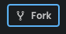

# Intro

[Slides](why-tests.md)

## What is NodeJS?

If you already started to learn JS, you know JS (JavaScript) is code that run in a web browser from a webpage. To write **unit tests** in JS you probably want something different. These should not be in browser. If so, they probably doing _user input validation_ (not unit test).

To run tests in JS you need a **test runner**. This is a small program that automatically detects any tests you created and runs them. The results are presented to you as a developer only, either in a terminal, or as a simple webpage.

When running tests in a terminal, you need a Javascript engine suitable for it. In most cases this is NodeJS, which you can install just like you install Java, Python or any programming language you want to code in. You may also run it in the cloud, for example using Codesandbox as suggested bellow.

## Project Setup

### Codesandbox

Codesandbox is an cloud-based developer environment where you can code frontend, backend or fullstack without downloading anything.

#### Getting started

Open [this codesandbox link](https://codesandbox.io/s/js-testing-intro-x3syj), then:

1. Fork sandbox using the top right button.  _This requires that you sign up with your Github account and Google account_.
2. Wait for startup animation to finish.
3. Navigate to Server Control Panel .
4. Click `🧪 yarn test` to start the test-runner.
5. Resize the terminal panel if needed.

### Local development

_\*\*This is needed if network is slow, or codesandbox is failing in other way_

#### Installation

You need to have [Node/NPM](https://nodejs.org/en/download/) downloaded and installed. Verify your installation with terminal commands `node -v` and `npm -v`,

#### Setup

**Alternative A.** Open a console, cd into to your local workspace folder, run 1) `git clone https://github.com/PinkProgramming/js-testing-intro.git`, 2) `cd js-testing-intro`, 3) `npm install` 4) `npm run test`

**Alternative B.** An empty project is created, like with any NodeJS project, in the console. then enter:

```bash
  mkdir my-nodejs-tests
```

```bash
  cd my-nodejs-tests
```

```bash
  npm init
```

In order to run tests, an extra npm package is needed. We will use [Jest](https://jestjs.io/), a popular one, also used in ReactJS, Angular, Typescript. Add the package like so:

```bash
  npm install --save-dev jest
```

then add the test runner to `package.json` inside "scripts":

```json
{
  "test": "jest --watchAll --verbose"
}
```

Now start the testing with terminal command:

```bash
  npm run test
```

## Exercises

- [Basic Testing](test/basics)
- [Website Testing](test/website-tests)

## Solutions

https://codesandbox.io/s/js-testing-intro-solutions-3o6h9
